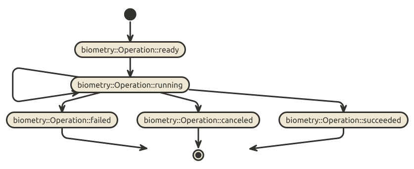

# Architecture & Technology

This section presents a high-level overview of the system design. The
system is devided into a set of core components and concepts that are
exposed via DBus to client applications.

Please note that we designed the core components such that other types
of (remote) interfaces are possible, e.g., a REST API. At the time of
this writing, DBus is the primary interface though.

The primary implementation language is C++11, and we offer both a C++11
client library as well as QML bindings. Other languages, runtimes and
toolkits can easily consume Biomtryd by either leveraging theq
aforementioned client bindings or by directly consuming the DBus API.

The following diagram gives an overview of the main interfaces as
further described in this secion:

## Device

A Device abstracts an arbitrary biometric device. It bundles together access to
a set of interfaces that enable client applications to:
 - enroll and query information about known templates
 - identify a user from a set of candidate users
 - verify that a given user is actually interacting with a device
 
### Template Store

A template store enables applications to manage and query information
about enrolled templates. A template is device-specific and its actual
data is *not* available to applications. Instead, it is referred to
and uniquely identified by a numeric id in the context of one specific
device implementation. Applications can:

- add (enroll) a template to the template store
 - remove an individual template from the template store
 - clear out all templates
 - list all enrolled templates
 
### Identifier

An identifier enables applications to identify one user from a given
set of candidate users.

### Verifier

A verifier enables applications to verify that a specific user is
interacting with a device.

## Operation

The overall system and access to its functionality is structured
around the notion of an asynchronous operation.  An operation is a
state machine as shown in: 

Client applications can start and cancel an operation, all other state
transitions are triggered by the device implementation executing an
operation. An operation and its state transitions can be observed by
client applications and certain type of devices hand out detailed
information about the ongoing operation.

Please note that both the service and device implementations might
cancel an ongoing operation, too.
